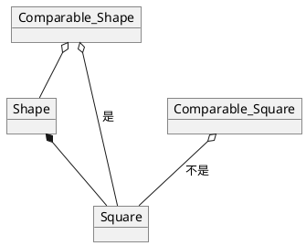

# 第一章 引论

## 1.1 数学知识

### 1.2.1 指数

$$ X^AX^B=X^{A+B} $$

$$ \frac{X^A}{X^B}=X^{A-B} $$

$$ (X^A)^B=X^{AB} $$

$$ X^N+X^N=2X^N\neq{X^{2N}} $$

$$ 2^N+2^N=2^{N+1} $$

### 1.2.2 对数

> 在计算机科学中，除非有特别声明，否则对数均以2为底

**定义 1.1**

$$X^A=B 当且仅当 \log_x B=A$$

**定理 1.1**

$$\log_A B = \frac{{\log}_C B}{{\log}_C A},A,B,C>0,A\neq1,B\neq1$$

**定理 1.2**

$$\log{AB}=\log{A}+\log{B};A,B>0$$

$$\log{A/B}=\log{A}-\log{B}$$

$$\log{A^B}=B\log{A}$$

$$\log{X}<X，对所有X>0成立$$

### 1.2.3 级数

$$\sum_{i=0}^N 2^i=2^{N+1}-1$$
和
$$\sum_{i=0}^N A^i=\frac{A^{N+1}-1}{A-1}$$
在第二个公式中，如果$0<A<1$，则
$$\sum_{i=0}^N A^i\leq\frac{1}{1-A}$$

$$\sum_{i=1}^N i^2=\frac{N(N+1)(2N+1)}{6}\approx\frac{N^3}{3}$$
$$\sum_{i=1}^N i^k\approx\frac{N^{k+1}}{\lvert{k+1}\rvert}, k\neq-1$$

下列公式中，数$H_N$叫做调和数，其和叫做调和和。其近似值称为**欧拉常数**
$$H_N=\sum_{i=1}^N \frac{1}{i}\approx{log_e N}$$

### 1.2.4 模数运算
如果N整除A-B,那么就说A与B摸N同余，记为$A\equiv B \pmod N$，这意味A除以N与B除以N的余数是一样的。
> 尽量少使用模运算

### 1.2.5 证明的方法

> 证明数据结构分析中的结论最常用的两种方法是归纳法和反证法。

**归纳法证明**

归纳法证明分为两个步骤。

> 第一步是证明**基准情形**，就是证明对于某些小的值的正确性。接着进行**归纳假设**，即假设知道对于某个有限数**k**的所有情况都是成立的，然后使用这个假设证明对于**k+1**也是成立的，即证明该定理。

例如证明斐波那契数列数，$F_k<{\frac{5}{3}^k}$
同理，我们也可以证明
$\sum_{i=1}^N i^2=\frac{N(N+1)(2N+1)}{6}$

**反例法证明**

公式$F_k\leq k^2$不成立，举例$F_11==144>11^2$

**反证法证明**

> 通过假设定理不成立，然后证明该假设导致某个已知性质不成立，从而原假设是错误的。

例如证明素数是无穷的。
假设定理不成立，存在某个最大素数$P_k$。令$P_1,P_2,\cdots,P_k$是依序排列的所有素数
N=$P_1P_2\cdots P_k+1$
，显然$N>P_k$,所以根据假设N不是素数，然而$P_1,P_2,\cdots,P_k$不能整除N，所以假设不成立，所以定理锝证。

## 1.3 递归简论

> 当一个函数用它自己来定义时就称为**递归**的

递归必须要有基准情况，即函数的值不用借助递归即可求得。

> 对于递归是否循环推理的？答案是：虽然用一个方法来定义自身，但是并没有用方法来定义该方法的一个特例。即使用f(5)来得到f(5)的值(直接或间接)才是循环的。

```
public static int bad( int n )
{
      if(n==0)
          return 0;
      else
          return bad(n / 3 + 1) + n - 1;
}
```
**无效终止递归方法**

**递归基本法则**

> 1. **基准情形**。必须要有某种基准的情形，不需要递归就能求解。
> 2. **不断推进**。对于某些递归求解情形，递归调用必须朝着基准情形推进。
> 3. **设计法则**。假设所有递归调用都能运行。
> 4. **合成效益法则**。在求解一个问题的同一实例时，切勿在不同的递归调用里做重复性的工作。

**打印输出整数**

假设仅有一个打印单个数字的I/O方法，命名为printDigit。

```
public static void printOut(int n){
  if(n >= 10)
    printOut(n/10);
  printDigit(n%10);
}
```
为了避免使用mod方法(因为耗时)，所以改为

```
public static void printOut(int n){
  if(n >= 10)
    printOut(n/10);
  printDigit(n-n/10*10);
}
```

## 1.4 实现泛型特性构建 pre-Java 5

### 1.4.1 使用Object表示泛型
### 1.4.2 基本类型的包装
### 1.4.3 使用接口表示泛型

考虑到进行某些运算时，基本代码是类型无关的，但和某个方法相关，这时就可以使用接口来实现类型无关的任务。

例如，Comparable接口包含compareTo方法可以用来比较大小。

首先，只有实现该接口的类才可以作为该接口类型传递给方法。

第二，如果两个接口类型有两个不相容的对象(一个String，一个Shape)，那么compareTo方法将会抛出**ClassCastException**。

第三，基本类型不能作为接口对象传递，但包装类可以。

第四，接口是不是标准的库接口不是必须的。

> 最后，该方法不一定能行得通，因为一颗**库里的类是final的**，那么就不能**扩展**出一个新类。此时用另外一种替代的方法，**function object**。

### 1.4.4 数组类型的兼容性
设Employee IS-A Person。那么，Employee[] IS-A Person[]是否成立？此外，如果Student IS-A Person，此时考虑：

```
Person[] arr = new Employee[5];//编译:array are compatible
arr[0] = new Student(...);//编译:Student IS-A Person
```

两句都将编译，运行时系统不能抛出**ClassCastException**，因为不存在类型转换。

为了解决这个问题，Java中的数组是类型兼容的，这叫做**协变数组类型**，如果将一个不兼容类型插入到数组中，虚拟机将会抛出**ArrayStoreException**。

> 协变就是如果Employee IS-A Person。那么，Employee[] IS-A Person[]是成立的，就是协变的。

## 1.5 利用Java 5泛型实现泛型特性成分
### 1.5.1 简单的泛型类和接口
### 1.5.2 自动装箱/拆箱
### 1.5.3 带限制的通配符
假设需要一个计算面积的方法，并且方法使用Collection<Shape>参数。

前面提到，数组是协变的。那么集合是否是协变的呢？

而使用泛型的一大原因就是为了能在**编译时**就能产生对应的错误而**不是**产生类型不匹配的**运行时异常**。
> 泛型集合不是协变的。

这样，集合不是协变的，就会限制集合的使用，转而使用数组。

> 集合不是协变的，所以Square IS-A Shape，Collection<Square> IS-NOT-A Collction<Shape>

为了解决**协变**，Java 5使用通配符解决。通配符表示参数类型的子类(或超类，及自身)。通配符包括**super**和**extends**。

### 1.5.4 泛型static方法
在泛型中使用特定类型的参数:
1. 该特定类型用于返回类型
2. 该类型用于多于一个参数类型中
3. 该类型用于声明一个局部变量

泛型方法中的类型参数位于**static**之后，**返回类型**之前。

### 1.5.5 类型限界

> 在特定类型参数的泛型方法中，如果需要保证该类型实现了某接口或继承了某类，则需要使用**类型限界**来解决。

```
public static <AnyType extends Comparable> ...
```
更好的写法是：
```
public static <AnyType extends Comparable<AnyType>> ...
```
因为接口现在也是泛型的了。

但是该做法仍然不能让人满意，假设Shape实现Comparable<Shape>，Square继承Shape。此时只是Square实现Comparable<Shape>。所以Square IS-A Comparable<Shpe>，但Square IS-NOT-A Comparable<Square>。
所以**最终的写法**是：
```
public static <AnyType extends Comparable<? super AnyType>> ...
```



### 1.5.6 类型擦除

> [参考文档1](http://blog.csdn.net/lonelyroamer/article/details/7868820)
> [参考文档2](http://blog.csdn.net/mack415858775/article/details/47830415)

> Java的泛型在虚拟机中编译器通过**类型擦除**将泛型转换成非泛型类。此时编译器生成与泛型类同名的**原始类**，但不包含类型参数，类型变量由**类型限界**代替。

### 1.5.7 对于泛型的限制

**基本类型**

不能使用基本类型做类型参数。

**instanceof检测**

instanceof检测和类型转换只在原始类中进行。
```Java
GenericMemoryCell<Integer> cell1 = new GenericMemoryCell<Integer>();
cell1.write(4);
Object cell =cell1;
GenericMemoryCell<String> cell2 = (GenericMemoryCell<String>) cell;
String s = cell2.read();
```
该程序在运行时时成功了，到最后一行时，会产生一个运行时错误，类型转换会产生一个警告，对应的instanceof检测是非法的。

**static的语境**
static方法和域均不可以引用类的类型变量，因为在类型擦除后类型变量就不存在了。因为只存在原始类，所以static域是**共享的**。

**泛型类型的实例化**
不能串讲一个泛型类型实例。
**泛型数组对象**
不能创建一个泛型的数组
```
T [] arr = new T[10];//右边是非法的。
```
T由限界替代，可能为Object。这样Object[] IS-NOT-A T[]。
**参数化类型的数组**

```
GenericMemoryCell<String> [] arr1 = new GenericMemoryCell<String>[10];
GenericMemoryCell<Double> cell = new GenericMemoryCell<Double>();cell.write(4.5);
Object arr2 = arr1;
arr2[0] = cell;
String s = arr1[0].read();
```
因为数组类型为GenericMemoryCell[]，所以不会产生ArrayStoreException。于是由于没有**类型转换**，最终在最后一行产生一个**ClassCastException**。

## 1.6 函数对象
为了不强制让某些方法实现某些接口，或者某些方法不一定是我们需要的方法。可以让一个函数通过一个对象来传递，这个对象叫做**函数对象**。


## 练习

#### 1.1 编写一个程序解决选择问题。令k=N/2,画出表格显示程序对于N中不同值得运行时间。

> [参考](http://blog.csdn.net/shuiziliu1025/article/details/50958241)
